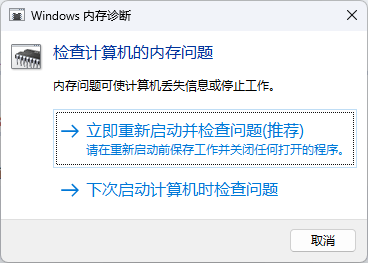

> 快速判断内存条是否存在硬件级故障，最省事的办法就是跑一遍系统自带的 **Windows 内存诊断工具**。整个过程无需第三方软件，支持中文提示，10~30 分钟出结果。

## 1 适用场景

| 症状                              | 是否推荐    |
| ------------------------------- | ------- |
| 随机蓝屏（MEMORY\_MANAGEMENT、IRQL 等） | ✅ 强烈推荐  |
| 死机、重启、程序无征兆崩溃                   | ✅       |
| 新装/更换内存后稳定性验证                   | ✅       |
| 想跑 MemTest86 但没 U 盘             | ✅ 可先跑这个 |

## 2 操作流程

### 2.1 启动工具

1. **Win + R** → 输入  
   ```text
   mdsched.exe
   ```
2. 弹出窗口选择  
   - **立即重新启动并检查问题（推荐）**  
     （所有未保存文件会丢失，请先保存。）

	  

### 2.2 自动重启 & 检测

- 机器将重启进入蓝底白字的 **Windows Memory Diagnostic** 界面。
- 默认执行 **Standard（标准）** 检测：  
  - 包含 8 种连续读写测试  
  - 耗时约 **10~30 分钟**（取决于内存大小/频率）
- 按 **F1** 可切换为 **Basic / Extended** 模式，一般保持默认即可。

### 2.3 完成 & 再次重启

- 进度条走到 100% 后，系统将 **自动重启回到桌面**。
- **不会**在测试界面显示最终结果，需下一步查看日志。

## 3 查看结果

1. **Win + X** → **事件查看器**  
   （或在运行输入 `eventvwr.msc`）`eventvwr.exe`、`eventvwr` 也可以
2. 导航到  
   ```
   Windows 日志 → 系统
   ```
3. 右侧 **筛选当前日志** → 事件来源选择  
   ```
   MemoryDiagnostics-Results
   ```
4. 双击最新一条信息事件，可看到如下字样：

   ```text
   在 2025-12-04T10:20:46.000Z 执行的内存诊断测试已完成，未检测到硬件错误。
   ```

   如果出现 `检测到硬件错误`，则内存条或插槽大概率有问题。


## 4 常见问题 FAQ

| 问题 | 解决方案 |
|---|---|
| 找不到 MemoryDiagnostics-Results | 确认已跑完测试并已重启；有时需等几分钟日志才会写入。 |
| 检测卡在 21%、87% 不动 | 通常仍在运行，可等待 1 小时；若长时间不动，强制关机后重跑。 |
| 提示硬件错误 | 逐条内存单插重跑，定位故障条；或换插槽排除主板问题。 |

## 5 与 MemTest86 的对比

| 维度 | Windows 内存诊断 | MemTest86 |
|---|---|---|
| 安装介质 | 无需 | 需制作启动 U 盘 |
| 检测深度 |  ★★★ |  ★★★★★ |
| 运行环境 | Windows 重启后 | 裸机（脱离系统） |
| 耗时 | 10~30 min | 2~8 h（2~4 Pass） |
| 结论 | 快速筛查 | 权威级验证 |

> 建议：先跑 Windows 内存诊断，如有报错再考虑 MemTest86 深度验证。

---

> **结论**：Windows 内存诊断工具足以应对 90% 的日常排障场景；零成本、易上手，推荐作为内存稳定性检查的第一站。

​	