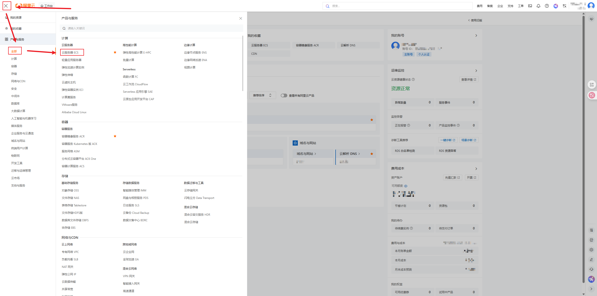
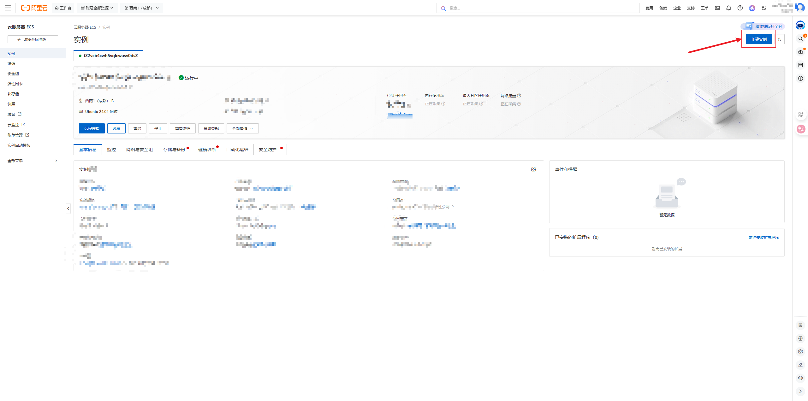
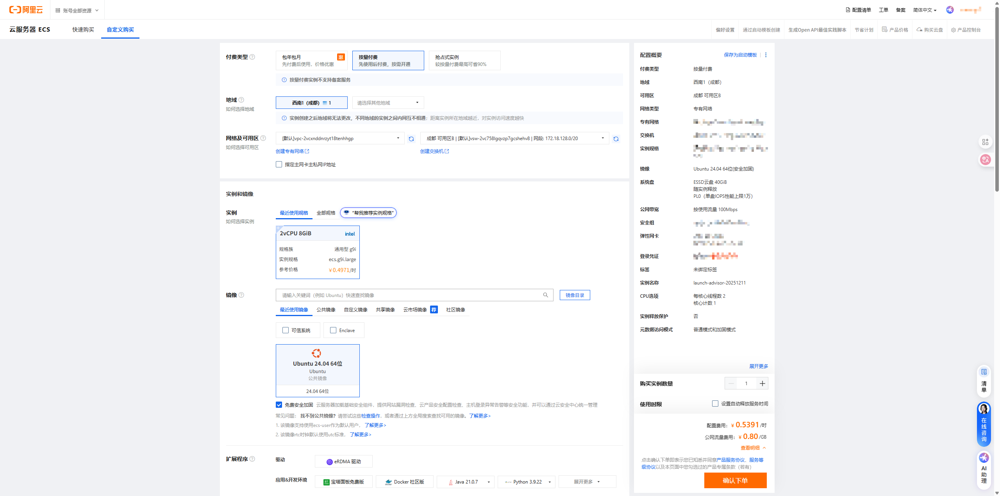
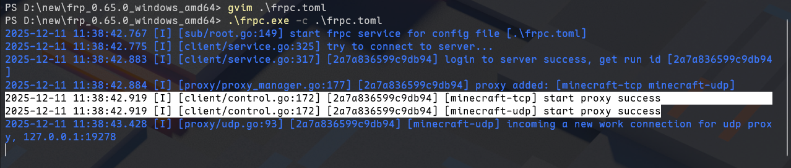

# Minecraft联机教程：使用阿里云搭建FRP服务器实现内网穿透（局域网联机）

在和朋友玩Minecraft（我的世界）、terraria（泰拉瑞亚）这些游戏进行联机，使用stram以及mc官方的服务器进行游戏的时候，会出现网络波动较为严重、偶尔掉线的问题，使用樱花frp、花生壳 等公共内网穿透服务虽然方便、免费，但是受限于连接数量以及人数使用，网络波动较大（当然，付费之后网络是比免费的要好一些的）。

在最近进行联机的时候我选择了frp+aliyun进行内网穿透来进行mc游戏联机，顺便编写了这边教程。

## 前置条件

- 一个阿里云账号：云平台账号用于创建云服务器进行穿透，阿里云需要账户里有100以上的余额才能创建按量付费的云主机，不想用阿里云可以使用其他云平台，地址: https://cn.aliyun.com/
- frp：在发布页下载合适的压缩包 https://github.com/fatedier/frp

## 服务器部分

打开阿里云的控制台，找到左边的三条横杠->全部->计算->云服务器



创建实例，选择合适的规格之后进行创建





设置安全组

开放端口7000，25565，22，81

| 端口    | 作用                                      |
| ----- | --------------------------------------- |
| 7000  | frp进行连接                                 |
| 25565 | mc进行联机                                  |
| 22    | 远程控制                                    |
| 81    | 这个是我用来存放mod，mc启动器，等等资源的端口，不需要使用的时候可以关闭。 |

启动之后，连接到云服务器，本地下载frp，并上传。

>我这里使用的是mobaxterm进行远程连接的，上传比较方便

将frp下载到本地，官网链接:https://github.com/fatedier/frp （网络连接好也可以直接下载到服务器）

```sh
wget https://github.com/fatedier/frp/releases/download/v0.65.0/frp_0.65.0_linux_amd64.tar.gz
```

下载完成之后上传到服务器，解压，并进入到目录下

```sh
# ls
frp_0.65.0_linux_amd64.tar.gz
~# tar -xf frp_0.65.0_linux_amd64.tar.gz
~# ls
frp_0.65.0_linux_amd64  frp_0.65.0_linux_amd64.tar.gz
~# cd frp_0.65.0_linux_amd64/
# ls
frpc  frpc.toml  frps  frps.toml  LICENSE
# cat frps.toml
bindPort = 7000
```

这里`frpc` 和 `frpc.toml` 是客户端文件，现在可以不用管，`frps.toml` 是服务端文件，没有什么需求的话也不用改，这里我们使用tmux，防止本地网络波动或操作过程切换网络导致服务端shell掉线，在终端输入tmux之后可以启动服务端了，

```sh
# ./frps -c frps.toml
2025-12-11 11:23:21.657 [I] [frps/root.go:108] frps uses config file: frps.toml
2025-12-11 11:23:21.745 [I] [server/service.go:236] frps tcp listen on 0.0.0.0:7000
2025-12-11 11:23:21.745 [I] [frps/root.go:117] frps started successfully
```

显示 successfully 启动成功

在命令行输入以下地址，其他玩家可以用`<IP>:<PORT>`来访问你的服务器下载东西，可以利用python，上传整合包到服务器，让其他玩家进行下载

```python
python3 -m http.server 81
```

## 客户端部分

这里的本地游戏客户端是Windows11，回到frp下载合适版本

```pwsh
wget https://github.com/fatedier/frp/releases/download/v0.65.0/frp_0.65.0_windows_amd64.zip
```

解压之后进入目录，同样显示几个文件（我这里使用的pwsh，也可以使用解压软件直接右击手动解压）

```sh
PS C:\Users\Leo> set-Location D:\new\
PS D:\new> get-ChildItem

    Directory: D:\new

Mode                 LastWriteTime         Length Name
----                 -------------         ------ ----
-a---          2025-12-11    11:26       27543880 frp_0.65.0_windows_amd64.zip
PS D:\new\frp_0.65.0_windows_amd64> Expand-Archive -Path .\frp_0.65.0_windows_amd64.zip -DestinationPath .\
PS D:\new\frp_0.65.0_windows_amd64> get-ChildItem

    Directory: D:\new\frp_0.65.0_windows_amd64

Mode                 LastWriteTime         Length Name
----                 -------------         ------ ----
-a---           2025-12-7     3:24       13794497 frp_0.65.0_windows_amd64.zip
-a---           2025-9-25    20:28       16414208 frpc.exe
-a---           2025-12-6    20:47            431 frpc.toml
-a---           2025-9-25    20:28       20792320 frps.exe
-a---           2025-9-25    20:31             16 frps.toml
-a---           2025-9-25    20:31          11358 LICENSE
```

这里同样有`frpc.exe`、`frpc.toml`、`frps.exe`、`frps.toml` 这几个文件，现在配置客户端`frpc.toml`配置文件

使用文本编辑软件如记事本、vim、vscode之类的编辑`frpc.toml`，最后内容为

```sh
Get-Content .\frpc.toml
# frp服务端地址（改为你的frps服务器IP）
serverAddr = "x.x.x.x"
serverPort = 7000

# Minecraft局域网联机转发配置 - TCP（备用）
[[proxies]]
name = "minecraft-tcp"
type = "tcp"
localIP = "127.0.0.1"
localPort = 25565
remotePort = 25565

# Minecraft局域网联机转发配置 - UDP（主要）
[[proxies]]
name = "minecraft-udp"
type = "udp"
localIP = "127.0.0.1"
localPort = 25565
remotePort = 25566
```

启动客户端frp，出现`start proxy success`链接成功

```
PS D:\new\frp_0.65.0_windows_amd64> .\frpc.exe -c .\frpc.toml
```



## Minecraft 部分

主机：打开游戏->单人游戏->设置->开启局域网联机
其他：打开游戏->多人游戏->直接连接/添加服务器->写入frp公网ip地址->加入服务器

---结束